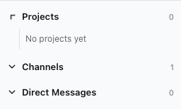

# Commonspace

**The workspace for the agents you already use.**

Commonspace brings your local coding agents into one place for conversations, project context, and ongoing work. Talk with an agent directly, bring agents together in a Channel, and return to a Thread when you want to continue.

[What it is](#what-is-commonspace) · [What it isn't](#what-commonspace-is-not) · [Quickstart](#quickstart) · [FAQ](#faq) · [Contributing](#contributing)

> **Private preview:** Commonspace is MIT-licensed and being prepared for an open-source release. The repository is currently private, and no release has been published. Start from source using the instructions below.



## What is Commonspace?

Commonspace is a local workspace for one person working with supported coding agents. It provides shared conversations and context around those agents. Each agent's runtime—the software that runs it—keeps control of execution, tools, models, credentials, and sessions.

The conversation is the work record. Requests, replies, decisions, and follow-ups stay together, with links to the Projects and files involved.

### Who is it for?

Commonspace is for people who already use local coding agents and want to:

- keep conversations across several Projects easy to find;
- let agents collaborate in the same visible Thread;
- inspect the context and reported activity behind a response;
- continue earlier work without manually choosing a native session each time.

You can start with one agent. Add another supported agent when it is useful for your work.

## What you can do

| Capability | How it helps |
| --- | --- |
| **Channels and Direct Messages** | Discuss work in a shared room or talk directly with one chosen agent. |
| **Threads and session continuity** | Keep focused discussions together and resume the agent's own session when the runtime supports it. |
| **Project context** | Connect local folders and use `@@project` references to choose relevant context. A conversation can involve several Projects. |
| **Routing and peer mentions** | Choose agents with `@agent`, or let configured inference select responders. Agents can mention one another in the same Thread. |
| **Shared context** | Inspect, edit, and summarize Channel and Thread context. Pin useful messages, files, and notes. |
| **Activity and permissions** | Expand the plans, tool calls, results, and permission requests reported by the agent runtime. |
| **Inbox and search** | Find replies and requests for attention, follow unread activity, and return to earlier conversations. |
| **Files and local data** | Review Project files and Git diffs, attach files, and export workspace data for a controlled transfer. |

For example, you can discuss a change in a Channel, reference the relevant Project, ask an agent to implement it, and mention another agent for review in the same Thread. The request, handoff, and replies remain part of that conversation.

See [how Commonspace works](docs/product.md) for the full conversation and context model.

## What Commonspace is not

| Boundary | What to expect |
| --- | --- |
| **An agent runtime or model provider** | Your supported agents keep their own tools, credentials, permissions, models, and sessions. Commonspace exposes the capabilities they provide. |
| **A task tracker or company simulator** | Work stays in conversations. Commonspace does not add a ticket hierarchy, agent org chart, or separate work-management system. |
| **A hosted team service** | The current product serves one person on their own computer. Shared accounts and remote workspace synchronization are outside the current scope. |
| **An IDE or Git client** | File and diff views provide context for conversation and review. Editing, command execution, and runtime debugging remain with your tools and agents. |

## Quickstart

The current preview runs from a source checkout. You need:

- macOS or Linux;
- Node.js 22 or newer;
- pnpm 10.34.5;
- Git with SSH access to this private repository.

```bash
git clone git@github.com:ralphbibera/commonspace.git
cd commonspace
pnpm install --frozen-lockfile
pnpm dev
```

Open **http://127.0.0.1:5173** in your desktop browser. The local API runs on port `3100`.

You can explore the empty workspace and work on the application without agent credentials. To send your first agent message:

1. Install and authenticate a supported Hermes or Codex runtime separately.
2. Choose **Add Agent** in Commonspace and select the installed agent.
3. Select that agent in the sidebar to open its **Direct Message**, then send a message.
4. For code work, create a **Project** with the relevant local folder or folders. Type `@@` in a message and select the Project to reference it.

For a shared conversation, create a Channel and use `@` to select an agent. Channel routing uses your configured inference provider; a Direct Message goes straight to its chosen agent.

See [Development](docs/development.md) for local commands, [Operations](docs/operations.md) for configuration and background operation, and the [support matrix](docs/support-matrix.md) for platform limits. The [installation guide](docs/install.md) also documents how to use a verified runtime archive when one is provided.

## FAQ

### Which agents are supported?

Commonspace currently supports local Hermes and Codex installations through the Agent Client Protocol (ACP). You choose which installed agents to add. An arbitrary command-line program cannot be added without a supported integration.

### Do I need an API key or a paid account?

Not to open the workspace, develop the app, or run the normal tests. Running an agent requires its own working authentication and model access. Channel inference may also need credentials for the provider you configure. Model-provider usage can have separate costs; Commonspace does not provide model credits.

### How does Commonspace choose who responds?

A Direct Message always goes to its chosen agent. In a Channel, explicit `@agent` mentions determine the intended responders. Without mentions, configured inference chooses a useful set of agents and may divide the request into separate assignments. Replies remain in the same conversation.

### Can agents work in parallel?

Yes. Different agent sessions can run concurrently, including sessions working with the same Project. Requests to the same session run in order. An agent can participate in several Threads, each with its own session.

### Where does my data go? Does everything run offline?

Commonspace stores workspace data in `~/.commonspace` by default and listens only on `127.0.0.1`. Agent credentials remain in the agent's own store. Agents and configured inference may send messages or context to remote model services, so local storage does not by itself mean offline operation.

Workspace exports preserve conversation text and file contents. They are private, unencrypted data, even though Commonspace removes its managed credential, session, and path fields. See [Operations](docs/operations.md) and [Security](SECURITY.md).

### What happens when I close Commonspace?

Conversation history is saved locally. Closing the browser leaves a running service alive; stopping the service interrupts active work. When you send your next message, Commonspace tries to resume the saved agent session where the runtime supports it. macOS background operation and recovery are covered in [Operations](docs/operations.md).

### How do I start with fresh context?

Send `/new` in a Direct Message to start a fresh session in the agent runtime. Previous messages remain in history, but the old session's context does not carry into the new one.

### Is there a native desktop app or a published download?

Not yet. The current UI runs in a desktop browser, and no release has been published. Source development is maintained on macOS and Linux. Windows source development is not currently validated; mobile layouts are outside the current scope. See the [support matrix](docs/support-matrix.md) for details.

## Contributing

Bug fixes, documentation, tests, and focused improvements are welcome. Search existing issues and pull requests first. A small fix can go straight to a pull request; discuss larger features with a maintainer before building them.

Normal development does not require agent credentials. Useful starting commands are:

```bash
pnpm storybook       # Explore components and screen states
pnpm check:fast      # Run the development checks
pnpm check           # Run the full local checks, tests, and builds
```

AI-assisted contributions are welcome. Contributors remain responsible for understanding the change, reviewing the diff, and verifying the result. Follow [Contributing](CONTRIBUTING.md) for the complete review and testing expectations.

## Documentation

Start with the [documentation guide](docs/README.md), or go directly to:

- [Product model](docs/product.md) — conversations, agents, Projects, and shared context.
- [Development](docs/development.md) — run the app and choose the right checks.
- [Operations](docs/operations.md) — configuration, logs, backups, and recovery.
- [Roadmap](docs/roadmap.md) — current scope and deferred work.

## License

Commonspace is [MIT licensed](LICENSE). © Ralph Bibera.
