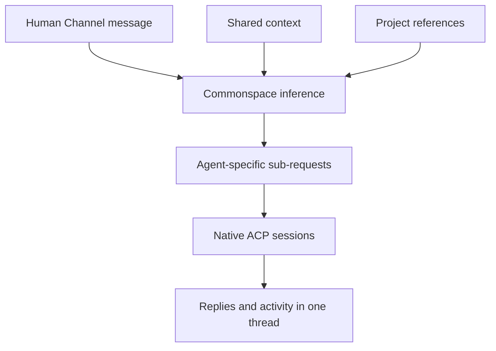

# Commonspace product specification

| Field | Value |
| --- | --- |
| Product | Commonspace |
| Positioning | The workspace for the agents you already use |
| Spec version | 1.0 |
| Decision state | Implementation-ready; product behavior is locked unless Ralph amends it |
| Last updated | 2026-08-30 |
| License | MIT |
| Primary release | v0.1 local private preview |

This is the canonical product-behavior specification for Commonspace. [Product direction](product-direction.md) defines the boundary and decision filter, [Product model](product.md) summarizes the domain, [Implementation gap audit](implementation-gap-audit.md) tracks current code against this specification, and [Roadmap](roadmap.md) sequences delivery.

UI layouts, visual styling, and interaction polish are intentionally not specified here. This document defines what the product must do and what every later UI must make possible.

## 1. Product definition

Commonspace is a fully open-source, local-first shared workspace for one human working with many local agent harnesses. It connects the agents the user already has, gives them shared conversational context, routes work between them, and preserves each harness's native session continuity.

Conversation is the product and the work record. Commonspace does not create a second task-management system around the conversation.

### Problem

Local coding agents usually live in isolated terminals, tabs, and native sessions. A user must repeatedly choose the right agent, restate Project context, coordinate handoffs manually, and remember which session owns which continuation. Parallel agent work becomes difficult to follow, while generic orchestration products add workflow objects that do not match how the user actually works.

Commonspace solves this by providing:

- Shared Channels and focused threads for agent collaboration.
- Persistent one-to-one DMs with exact agent continuity.
- Smart, inspectable routing through one Commonspace inference layer.
- Visible Project references rather than Project-owned task containers.
- Canonical shared context that remains separate from private harness context.
- Local persistence, search, unread state, attachments, activity, and recovery.

### Primary user

The v0.1 user is one technical person who already uses supported local ACP agent harnesses and wants to work with several agents across one or more codebases without becoming the manual message broker between them.

### Core job to be done

> When I have work that may involve one or several local agents, let me state it once in the right conversation, keep the relevant Project and shared context visible, route only the necessary part to each agent, and preserve every continuation and result in one understandable record.

### Product promise

A user can open Commonspace, talk naturally in a Channel or DM, and trust that:

1. The right agent or agents receive the right bounded request.
2. Each conversation continues the correct native harness session.
3. Project, Channel, and Thread context remains visible and correctable.
4. Parallel work stays legible without a coordinator or task bureaucracy.
5. Local state and harness authority remain under the user's control.

## 2. Goals and exclusions

### Goals

| ID | Goal |
| --- | --- |
| G1 | Make one human effective with many reusable local agents. |
| G2 | Make Channels, DMs, messages, and threads the complete work record. |
| G3 | Route and decompose requests with visible, correctable inference. |
| G4 | Preserve exact native-session continuity while exposing safe shared context. |
| G5 | Let messages and threads reference zero, one, or many Projects. |
| G6 | Keep agent collaboration peer-to-peer and visible through mentions. |
| G7 | Surface normalized harness activity, results, and permission choices without replacing the harness. |
| G8 | Remain local-first, recoverable, portable, and fully open source. |

### Explicit non-goals for v0.1

- Tasks, tickets, goals, objectives, priorities, assignees, workflows, kanban, budgets, or approval pipelines.
- Company simulation, org charts, agent employees, managers, captains, or a required coordinator agent.
- Multi-human accounts, roles, remote workspace sync, or hosted collaboration.
- Replacing agent runtimes, models, tools, credentials, private memory, or native sessions.
- Wrapping arbitrary unsupported CLIs. v0.1 supports known ACP harnesses through first-party integrations.
- Agent-created Channels, Projects, or workspace structure.
- A standalone agent-management dashboard or agent profile pages.
- A full Git client, terminal, execution manager, or raw harness debugger.
- Generic plugins or third-party extension lifecycle.
- Resource types beyond local folders, although the Project model must leave room for them later.
- Reactions, agent-suggested durable context, and automatic acceptance of agent-written memory.
- A relational transcript store before measured scale requires one.

## 3. Product principles

1. **Conversation is the work record.** Execution state belongs to messages and replies, not to a parallel task object.
2. **Agents are real harnesses.** Commonspace reflects supported local ACP agents and never pretends to be their runtime.
3. **Context is explicit.** Project references, shared context, routing decisions, and compaction state must be inspectable and correctable.
4. **Native continuity is exact.** A thread or DM resumes its mapped native session whenever the harness supports it.
5. **Agents are peers.** A visible mention is the handoff. No coordinator is required.
6. **Inference is infrastructure.** One configured Commonspace inference layer handles routing, decomposition, Project resolution, context compaction, and routing-memory compaction.
7. **Harness capabilities are authoritative.** Commonspace exposes only models, reasoning modes, tools, permissions, and controls advertised through ACP.
8. **Parallel by default.** Different native sessions may run concurrently. Only work targeting the same native session is serialized.
9. **Local authority.** Workspace state, files, native processes, and credentials remain on the machine unless the user explicitly configures a remote inference endpoint.
10. **No silent fiction.** Commonspace must not hide routing failures, rewrite delivered history, invent permissions, or imply that an interrupted run completed.

## 4. Conceptual model

| Object | Product meaning | Key rule |
| --- | --- | --- |
| Workspace | One local Commonspace installation and its durable state. | One human is the authority in v0.1. |
| Agent | One workspace-visible reflection of a supported local ACP harness identity. | The same Agent is reused across Projects and conversations; Commonspace does not clone it per Project. |
| Project | A named context container with one or more resources. | Projects are references, not task owners. Local folders are the only v0.1 resource type. |
| Channel | A shared conversation with an agent roster, instructions, settings, and canonical shared context. | A Channel may be projectless and does not permanently belong to one Project. |
| DM | A persistent conversation between the human and exactly one chosen Agent. | Smart routing never substitutes another Agent. |
| Message | Human, Agent, or system conversation content with references and attachments. | Accepted messages are persisted before inference or agent execution. |
| Thread | The focused continuation created by a Channel root message. | Each participating Agent has its own native session inside the Thread. |
| Project reference | A visible link from a message, sub-request, or Thread to a Project. | References can be explicit or inferred and must be correctable. |
| Sub-request | The bounded request assigned to one Agent after routing/decomposition. | The Agent receives its sub-request, not the entire original message as its new turn. |
| Native session | The opaque session owned by a harness for one Agent in one Thread or DM generation. | Its identifier remains host-private. |
| Shared context | Canonical Commonspace context available separately from native-session context. | Users can inspect, edit, and manually compact it. |
| Routing memory | Compacted knowledge derived from explicit routing corrections. | It influences later routing without altering historical decisions. |
| Attachment | A durable file associated with a specific message version. | Humans and supported harnesses can attach files. |
| Activity | Normalized ACP reasoning summaries, plans, tools, results, usage, permissions, and controls. | Raw terminal output remains in the harness. |

### Authority boundary

| Commonspace owns | The harness owns |
| --- | --- |
| Workspace objects and appearance | Actual Agent behavior and identity |
| Conversation persistence and branches | Models and reasoning modes |
| Routing, decomposition, and routing memory | Tools and tool behavior |
| Project references and shared context | Native permission semantics |
| Native-session mapping | Native session internals and private compaction |
| Normalized ACP activity presentation | Runtime configuration and credentials |
| Search, unread state, notifications, export/import | Raw terminal and runtime debugging |

## 5. Primary experience

### 5.1 First run and Agent addition

1. The local Commonspace service starts and the browser or desktop client connects to it.
2. The workspace starts without silently importing every installed Agent.
3. When the user chooses **Add Agent**, Commonspace scans only for supported ACP harnesses.
4. The user explicitly selects the harness identity to add.
5. Commonspace may assign a local display name, emoji/avatar, and accent color without renaming or altering the native harness profile.
6. The Agent becomes available for DMs, Channel membership, mentions, and routing.

### 5.2 Project setup

1. The user creates a Project with a name and one or more local folders.
2. The first folder is the primary working directory and later folders are additional context roots.
3. Commonspace canonicalizes and validates every folder locally.
4. Creating a Project does not create a Channel, task, or Project-specific Agent copy.
5. The Project is available as a visible reference in any Channel, Thread, or DM.

### 5.3 Unaddressed Channel message

1. The human sends a root message in a Channel, with zero or more explicit Project references.
2. Commonspace persists and displays the message immediately.
3. The message creates a Thread.
4. The inference layer resolves missing Project references, selects the smallest useful set of Agents, and decomposes the message when responsibilities differ.
5. The user can inspect which Agents were selected, each generated sub-request, its Project references, and the routing reason.
6. Commonspace dispatches each sub-request to that Agent's native session in the Thread.
7. Different Agent sessions run concurrently. Calls to the same native session are serialized.
8. Replies, activity, results, and attention states appear under the same Thread.

### 5.4 Explicitly addressed Channel message

1. One or more explicit `@agent` mentions are authoritative.
2. A mentioned Agent not already seated in the Channel is added immediately and invoked.
3. When several Agents are mentioned, inference may decompose the message between those Agents but may not replace them with different Agents.
4. Explicit Project references are authoritative for the message. Inference may assign a relevant subset to each sub-request.

### 5.5 Thread continuation and peer handoff

1. A human reply continues the exact native sessions already mapped to that Thread.
2. Project references inherit from the Thread unless the new message explicitly adds, removes, or corrects them.
3. A change affects the new message and future Thread defaults, never the context already delivered in earlier turns.
4. An Agent can mention another Agent in its visible reply.
5. That mention invokes the Agent in the same Thread with the newly delivered handoff message and bounded shared context.
6. Repeated Agent-to-Agent cycles are bounded and surfaced without adding a coordinator or task gate.

### 5.6 Direct Message

1. A DM always targets the selected Agent directly.
2. Project references may be explicit or inferred, but Agent selection does not run.
3. Every normal continuation resumes the current DM native session.
4. `/new` creates a visible generation boundary, cancels the old in-flight generation where possible, and starts a fresh native session.
5. Late replies from the old generation cannot cross into the new generation.

### 5.7 Context inspection and compaction

1. The user can inspect the Project, Channel, and Thread context available to an Agent.
2. Channel context exposes its summary, decisions, open questions, source boundary, estimated pressure, origin, and compaction state.
3. A new Thread snapshots the current Channel context and then develops its own Thread context.
4. Automatic compaction responds to estimated context/token pressure.
5. The user can trigger compaction manually and edit the canonical compacted representation.
6. User-written context remains authoritative and is not silently overwritten by automatic projection.
7. If new source messages make edited context incomplete, Commonspace marks it stale rather than pretending it is current.

### 5.8 Message correction

1. Editing a delivered human message creates a new message version and conversation branch from that point.
2. The original branch, replies, routing decision, and native sessions remain available as history.
3. The edited version can be routed again and receives new native-session continuations where required.
4. Deleting delivered content leaves a visible deletion marker and minimal delivery metadata.
5. Agent replies cannot be edited as if they were human-authored messages.

### 5.9 Files and permissions

1. A human can attach a normal local file to a message.
2. A supported Agent can attach a harness-generated file through normalized ACP artifact data.
3. Attachments remain bound to the exact message version that delivered them.
4. Known credential-bearing files are refused.
5. When a harness requests permission, Commonspace shows only the choices advertised by that harness.
6. The pending permission blocks only the affected native session and creates an attention item and notification.

### 5.10 Closing and reopening Commonspace

1. Closing the client does not stop the local service or active Agent sessions.
2. Reopening the client reconstructs the workspace from the service's durable state.
3. Restarting Commonspace or the machine resumes stored native sessions when the harness supports it.
4. A turn that was interrupted and cannot be resumed is marked interrupted or failed, never silently completed.

## 6. Functional requirements

`v0.1` means required for the complete private-preview product. `Capability-dependent` means required only when the connected harness advertises the relevant ACP capability. `Later` means deliberately outside the v0.1 release gate.

### 6.1 Workspace and lifecycle

| ID | Target | Requirement | Acceptance condition |
| --- | --- | --- | --- |
| WRK-01 | v0.1 | Run as a local service with browser clients over loopback. | The workspace remains usable without a hosted Commonspace account or cloud control plane. |
| WRK-02 | v0.1 | Keep the service independent from the visible client. | Closing every client does not terminate an accepted or active turn. |
| WRK-03 | v0.1 | Limit structural workspace mutations to the human. | Agents cannot create/delete Projects, Channels, DMs, or Agents through v0.1 context tools. |
| WRK-04 | v0.1 | Restore durable state after service or machine restart. | Conversations, context, read state, and resumable native-session mappings survive restart. |
| WRK-05 | v0.1 | Support a one-command local installation/update path. | A clean supported machine can install, start, stop, and update Commonspace without repository knowledge. |
| WRK-06 | Later | Offer a desktop application over the same service contract. | The desktop distribution does not fork the domain or persistence model. |

### 6.2 Agents and harnesses

| ID | Target | Requirement | Acceptance condition |
| --- | --- | --- | --- |
| AGT-01 | v0.1 | Add Agents only through an explicit user-initiated discovery flow. | Startup does not silently add discovered harness profiles. |
| AGT-02 | v0.1 | Support known ACP harnesses through first-party adapters. | Unsupported arbitrary CLIs are rejected rather than represented as partially functional Agents. |
| AGT-03 | v0.1 | Reuse one Agent identity across Projects, Channels, DMs, and Threads. | No per-Project Agent clone or hidden Project-specific memory identity is created. |
| AGT-04 | v0.1 | Allow workspace-local display name, avatar/emoji, and accent changes. | Native harness identity and configuration remain unchanged. |
| AGT-05 | Capability-dependent | Expose models, reasoning, steering, stopping, tools, and permissions only when advertised through ACP. | The UI and API do not synthesize unsupported choices. |
| AGT-06 | v0.1 | Avoid standalone Agent profile/dashboard requirements. | Agent discovery and context remain available through addition, DMs, Channel membership, mentions, and session indicators. |

### 6.3 Projects and references

| ID | Target | Requirement | Acceptance condition |
| --- | --- | --- | --- |
| PRJ-01 | v0.1 | Support Projects with one or more canonical local folders. | The first root becomes the primary working directory and remaining roots are delivered as additional working directories. |
| PRJ-02 | v0.1 | Allow messages, sub-requests, and Threads to reference zero, one, or many Projects. | Search, context, attribution, and execution recognize every reference, not only the first. |
| PRJ-03 | v0.1 | Treat explicit Project references as authoritative. | Inference cannot silently remove or replace an explicit reference. |
| PRJ-04 | v0.1 | Infer Project references when none are explicit. | Every inferred reference is marked as inferred and can be corrected before or after dispatch through a new branch/reroute. |
| PRJ-05 | v0.1 | Assign Project references per sub-request. | A split request can give different Agents different relevant Project roots. |
| PRJ-06 | v0.1 | Let Thread references evolve prospectively. | A reply can add/remove a reference for that turn and future defaults without rewriting earlier deliveries. |
| PRJ-07 | v0.1 | Keep projectless conversation genuinely projectless. | An Agent in a no-Project turn receives no Project filesystem roots and starts in a neutral configured working directory. |
| PRJ-08 | Later | Add non-folder Project resource kinds. | New resource kinds extend the Project resource contract without turning Projects into tasks. |

### 6.4 Channels, DMs, messages, and Threads

| ID | Target | Requirement | Acceptance condition |
| --- | --- | --- | --- |
| CON-01 | v0.1 | Allow universal/projectless Channels with explicit Agent rosters. | Channel creation does not require a Project or Agent. |
| CON-02 | v0.1 | Persist every accepted message before inference or execution. | A routing or harness failure cannot erase the human's request. |
| CON-03 | v0.1 | Create one Thread from every Channel root message. | All routed sub-requests, replies, handoffs, and activity remain navigable from that root. |
| CON-04 | v0.1 | Map one native session per participating Agent per Thread. | The same Agent resumes the same Thread session and uses a different session in another Thread. |
| CON-05 | v0.1 | Keep DMs bound to exactly one chosen Agent. | Unaddressed DM messages never trigger Agent selection. |
| CON-06 | v0.1 | Enforce hard `/new` DM generation boundaries. | Old context and late in-flight replies cannot enter the new generation. |
| CON-07 | v0.1 | Invoke visible Agent mentions as peer handoffs in the same Thread. | Mentioned Agents receive the handoff without a coordinator or private Agent DM. |
| CON-08 | v0.1 | Run different native sessions concurrently and serialize only the same session. | A slow Agent does not block unrelated Agents or Threads. |
| CON-09 | v0.1 | Bound pathological Agent-to-Agent cycles. | Repeated cycles stop with a visible outcome rather than silently looping. |
| CON-10 | v0.1 | Preserve queued follow-ups while a native session is busy. | The user can inspect, reorder, remove, steer where supported, or stop-and-send queued input. |

### 6.5 Commonspace inference, routing, and correction

| ID | Target | Requirement | Acceptance condition |
| --- | --- | --- | --- |
| INF-01 | v0.1 | Use one configured inference provider for routing, decomposition, Project resolution, context compaction, and routing-memory compaction. | These functions do not require a visible coordinator Agent or separate provider configurations. |
| INF-02 | v0.1 | Route every unaddressed Channel message through inference. | There is no deterministic/no-inference fallback that silently guesses an Agent. |
| INF-03 | v0.1 | Treat explicit Agent mentions as authoritative. | Inference may split work among mentioned Agents but cannot substitute unmentioned Agents. |
| INF-04 | v0.1 | Select the smallest useful Agent set. | One Agent is preferred when sufficient; distinct responsibilities may select any necessary set. |
| INF-05 | v0.1 | Remove hidden product-wide Agent fan-out caps. | Explicit or inferred requests are not silently limited to two Agents; any safety ceiling is visible and user-controlled. |
| INF-06 | v0.1 | Generate one bounded sub-request per selected Agent. | Each Agent's new native turn contains only its assigned request; the original remains accessible through bounded context tools. |
| INF-07 | v0.1 | Make routing inspectable. | The selected Agents, sub-requests, Project references, reason, and confidence where available are stored with the source message. |
| INF-08 | v0.1 | Support sub-request rerouting and correction. | A user can redirect one assignment without resending unrelated assignments. Prior attempts remain visible. |
| INF-09 | v0.1 | Learn from explicit corrections. | Reroutes are stored as feedback and compacted into bounded routing knowledge used by later decisions. |
| INF-10 | v0.1 | Fail visibly when inference is unavailable or invalid. | The message remains accepted and receives a retryable needs-attention state; Commonspace does not silently broadcast it. |
| INF-11 | v0.1 | Target effectively immediate routing. | The routing stage targets sub-second completion where the configured provider permits and reports separately from harness execution time. |

### 6.6 Shared context and compaction

| ID | Target | Requirement | Acceptance condition |
| --- | --- | --- | --- |
| CTX-01 | v0.1 | Maintain canonical Commonspace context separately from private native-session context. | Shared context can be inspected without exposing native session internals. |
| CTX-02 | v0.1 | Store Channel summary, decisions, open questions, pins, source boundary, origin, estimated pressure, and compaction state. | The current representation has enough metadata to explain whether it is empty, current, stale, compacting, or failed. |
| CTX-03 | v0.1 | Snapshot Channel context when a Thread begins. | Later Channel changes do not silently rewrite the Thread's inherited starting context. |
| CTX-04 | v0.1 | Maintain Thread-specific context after the snapshot. | A Thread can compact its own history and still inspect newer Channel context separately. |
| CTX-05 | v0.1 | Include recent verbatim messages alongside compacted context within bounded reads. | Agents can distinguish source conversation from inferred summaries. |
| CTX-06 | v0.1 | Trigger automatic compaction primarily from context/token pressure. | A fixed message count alone is not the authoritative trigger. |
| CTX-07 | v0.1 | Allow manual compaction and direct human editing. | A user can update the canonical summary, decisions, and questions without changing private harness memory. |
| CTX-08 | v0.1 | Preserve human-authored context. | Automatic projection marks human context stale when needed and never silently replaces it. |
| CTX-09 | v0.1 | Expose bounded context through scoped tools. | An Agent can read only the conversation and Project scope granted to its current native session. |
| CTX-10 | Later | Accept Agent-suggested durable context. | No v0.1 Agent response can silently promote itself into canonical memory. |

### 6.7 Message versions, deletion, pins, and files

| ID | Target | Requirement | Acceptance condition |
| --- | --- | --- | --- |
| MSG-01 | v0.1 | Edit delivered human messages through visible branching/versioning. | Editing creates a new branch and new downstream native turns; the old branch remains navigable. |
| MSG-02 | v0.1 | Preserve deletion markers for delivered messages. | The transcript records that content was delivered even when its body is removed. |
| MSG-03 | v0.1 | Keep Agent replies immutable as harness output. | A human cannot edit an Agent reply and misrepresent it as native output. |
| MSG-04 | v0.1 | Pin messages, files, and human notes into shared context. | Pins identify their source, scope, and removal state and are available to scoped context reads. |
| FIL-01 | v0.1 | Allow humans to attach general local files to messages. | Supported files persist, render or download safely, and reach the intended Agent session. |
| FIL-02 | Capability-dependent | Accept harness-generated files as Agent attachments. | A supported ACP artifact becomes a durable Commonspace attachment without exposing its host path. |
| FIL-03 | v0.1 | Bind attachments to exact message versions. | Editing/branching does not silently move an attachment to another version. |
| FIL-04 | v0.1 | Block known credential-bearing files. | Common secret, key, token, and credential containers cannot be attached or previewed. |
| FIL-05 | v0.1 | Keep Project file/Git surfaces read-oriented. | Commonspace may show files, changes, diffs, and emitted verification but does not become a Git client or execution manager. |

### 6.8 Harness activity, controls, and outcomes

| ID | Target | Requirement | Acceptance condition |
| --- | --- | --- | --- |
| ACT-01 | Capability-dependent | Stream and persist normalized ACP reasoning summaries, plans, tool calls/results, usage, and model information. | Activity stays expandable and collapsed by default; raw terminal output is not synthesized into it. |
| ACT-02 | Capability-dependent | Render native permission requests with only harness-provided choices. | Selecting a choice returns that exact response to the affected harness session. |
| ACT-03 | Capability-dependent | Support native stop and steering controls. | Unsupported controls are absent, not disabled promises. |
| ACT-04 | v0.1 | Bind results and evidence to the originating request and sub-request. | Replies can expose changed files, Project/root attribution, activity, and harness-emitted validation evidence. |
| ACT-05 | v0.1 | Surface explicit run outcomes. | Completed, needs input, failed, silent, cancelled, timed out, and interrupted states remain distinguishable. |
| ACT-06 | v0.1 | Scope blocking to the affected native session. | A permission request or slow turn does not block the Channel or other Agent sessions. |

### 6.9 Inbox, search, and notifications

| ID | Target | Requirement | Acceptance condition |
| --- | --- | --- | --- |
| DSC-01 | v0.1 | Track durable unread state for Agent replies and relevant system outcomes. | Read state survives restart and opens the exact conversation location. |
| DSC-02 | v0.1 | Provide an attention-focused Inbox. | Replies, mentions, permission requests, needs-input outcomes, and failures can be filtered and navigated exactly. |
| DSC-03 | v0.1 | Search messages, Threads, Channels, Agents, Projects, and attachments. | Project filters match any referenced Project, not only the primary compatibility reference. |
| DSC-04 | v0.1 | Support desktop notifications for replies, mentions, permissions, and failures. | Each notification identifies the event type and opens the exact message/activity. |
| DSC-05 | v0.1 | Make notifications configurable without muting durable Inbox state. | Disabling OS notifications does not hide attention items inside Commonspace. |

### 6.10 Persistence, privacy, and portability

| ID | Target | Requirement | Acceptance condition |
| --- | --- | --- | --- |
| DAT-01 | v0.1 | Persist versioned, sanitized state atomically with rollback recovery. | A partial/invalid write does not replace the previous valid state. |
| DAT-02 | v0.1 | Keep credentials, MCP capabilities, opaque native session IDs, and host paths private. | Browser snapshots, activity, search, and portable exports do not contain them. |
| DAT-03 | v0.1 | Provide an open, versioned export of non-secret workspace data and attachments. | The archive is documented and usable without Commonspace cloud services. |
| DAT-04 | v0.1 | Validate imports and resolve local resource mappings explicitly. | Import cannot overwrite current state or assume that exported absolute paths exist. |
| DAT-05 | v0.1 | Keep data indefinitely by default and provide explicit retention controls. | Destructive cleanup is scoped, previewable, and does not silently rewrite delivered history. |
| DAT-06 | v0.1 | Disclose configured inference data flow. | The user can see whether inference is local or remote and what categories of conversation/context may be sent. |
| DAT-07 | Later | Migrate transcripts to a relational store only after measured need. | The product model and export format do not depend on the current JSON persistence implementation. |

## 7. Context model

Context is composed at request time from independent layers. Commonspace must preserve the origin of each layer rather than flattening everything into an unexplained prompt.

| Layer | Scope | Contents | Lifecycle |
| --- | --- | --- | --- |
| Project context | Per Project reference | Resource identity, permitted roots, relevant files/changes when requested | Changes with Project resources and per-message references |
| Channel context | Per Channel | Summary, decisions, questions, pins, compacted history | Shared across Threads; editable and pressure-compacted |
| Thread snapshot | Per Thread | Channel context revision captured when the Thread begins | Immutable starting reference |
| Thread context | Per Thread | Thread summary, decisions, questions, pins, recent messages | Evolves and compacts independently |
| Routing memory | Workspace/Channel bounded | Compacted explicit reroute corrections | Updated only from correction events |
| Native context | Per Agent native session | Harness-owned private session state | Opaque and controlled by the harness |

### Context precedence

1. Current explicit human instruction.
2. Explicit Agent and Project references on the current message.
3. Human-edited Thread context and pins.
4. Human-edited Channel context and pins.
5. Recent verbatim conversation.
6. Automatically compacted Thread and Channel context.
7. Routing memory for routing only.

Inference output cannot override an explicit current-message reference. Automatically generated context must remain distinguishable from human-authored context.

### Compaction state

| State | Meaning |
| --- | --- |
| Empty | No meaningful compacted representation exists yet. |
| Current | The representation covers the recorded source boundary. |
| Stale | New source content exists beyond the representation or a human edit requires reconciliation. |
| Compacting | Inference is producing a replacement or merge. |
| Failed | The most recent compaction failed; the last valid representation remains available. |

## 8. Routing model

For each Channel root or newly routable follow-up, the inference layer produces a bounded decision containing:

- Resolved explicit and inferred Project references.
- Selected Agent IDs.
- One sub-request per selected Agent.
- Project references relevant to each sub-request.
- A concise routing reason.
- Confidence when the provider supplies a meaningful value.

The original human message remains canonical and visible. Sub-requests are routing artifacts attached to it, not fake human messages.

### Reroute semantics

- A reroute targets one sub-request.
- The original assignment and any response remain visible.
- The user may change the Agent, sub-request wording, or Project references.
- The new Agent receives the corrected sub-request plus scoped shared context.
- The correction event becomes routing feedback.
- Feedback compaction may generalize patterns but cannot edit historical routing records.

### Inference failure semantics

- Invalid, empty, timed-out, or unavailable inference does not broadcast the full message.
- The accepted source message remains visible with a routing-failed attention state.
- The user can retry inference, edit/branch the source, or explicitly address an Agent.
- Commonspace logs bounded diagnostics without storing provider secrets or raw sensitive payloads.

## 9. Conversation and execution states

These states describe message delivery and native execution. They are not task workflow statuses.

| State | Meaning |
| --- | --- |
| Accepted | The source message is durably stored. |
| Routing | Commonspace inference is resolving assignments/context. |
| Queued | Input is waiting for the same native session to become available. |
| Running | The harness accepted the native turn. |
| Needs input | A permission or harness question requires the human. |
| Completed | A normal Agent result was recorded. |
| Silent | The harness completed without a user-facing reply. |
| Failed | Routing or harness execution failed with an actionable reason. |
| Cancelled | The human or a hard boundary stopped the turn. |
| Timed out | A configured execution boundary elapsed. |
| Interrupted | The service stopped and the harness could not resume the in-flight turn. |

## 10. Safety, privacy, and reliability

### Local and network behavior

- Commonspace binds its service to loopback and guards mutations by origin.
- ACP runs locally between Commonspace and supported harness processes.
- Commonspace does not copy or manage harness credentials.
- A user-configured OpenAI-compatible inference endpoint may be remote. Commonspace must clearly disclose that routing/context data can leave the machine in this configuration.
- Inference receives only the bounded message, candidate metadata, Project labels/references, and relevant shared context required for its function. Project file contents are not included by default.

### Data handling

- Native session references, absolute host paths, capabilities, secrets, and credentials are host-private.
- Persisted activity and error data is bounded and sanitized.
- Attachments are stored locally with private metadata and served only through authorized loopback requests.
- Known secret-bearing files and unsafe preview types are rejected.
- Portable exports omit secrets, opaque sessions, capabilities, and absolute host paths.

### Reliability invariants

- Once a message is accepted, later failure cannot erase it.
- `/new`, Agent removal, Channel removal, and shutdown are hard generation boundaries.
- Stale replies from cancelled or replaced generations cannot mutate the current conversation.
- Same-session calls are serialized; unrelated sessions remain concurrent.
- State changes are versioned, sanitized, migration-tested, and atomically persisted.
- A failed compaction keeps the last valid context.
- A failed inference decision never silently becomes an all-Agent broadcast.

## 11. Release slices

The implementation order is behavior-first. UI/UX work begins after the underlying contracts and failure semantics stabilize.

### Slice A: Complete Commonspace inference

- Agent-specific sub-requests.
- Project-reference inference and per-sub-request references.
- Visible reroute/correction events.
- Compacted routing memory.
- Removal of the hidden two-Agent inference cap.

### Slice B: Complete conversation context and history

- Thread context snapshots and independent Thread compaction.
- Prospective Thread Project-reference changes.
- Pins.
- Human message edit branches and deletion markers.

### Slice C: Complete collaboration artifacts and controls

- General human and Agent attachments.
- Normalized native permission request/response flow.
- Runtime/authentication diagnostics.

### Slice D: Complete operability

- Installed background service and clean-machine lifecycle.
- Desktop notifications.
- Open export/import and retention controls.
- Restart/interruption recovery acceptance coverage.

### Slice E: UI/UX implementation

- Multi-Project and inferred-reference controls.
- Routing/sub-request inspection and rerouting.
- Channel/Thread context inspector, editor, pins, and compaction controls.
- Message branch/version navigation and deletion surfaces.
- File, permission, diagnostics, notification, and data-management surfaces.
- Keyboard, narrow-screen, light, and dark acceptance coverage.

## 12. End-to-end acceptance scenarios

| ID | Scenario | Required result |
| --- | --- | --- |
| E2E-01 | Send a projectless unaddressed Channel message | It is persisted, routed by inference, dispatched to the smallest useful Agent set without Project filesystem access, and recorded in one Thread. |
| E2E-02 | Ask backend and frontend work spanning two Projects | Inference creates inspectable Agent-specific sub-requests with the correct Project subset; sessions run concurrently and replies share one Thread. |
| E2E-03 | Mention an Agent not seated in a Channel | The Agent is added and invoked immediately without replacing explicit routing intent. |
| E2E-04 | Continue the same Agent in two Threads | Each Thread resumes its own native session and both may run concurrently. |
| E2E-05 | Use `/new` during an active DM | The old generation is cancelled or isolated, a visible boundary appears, and no late reply crosses into the new session. |
| E2E-06 | Reach Channel context pressure after a human edit | Context becomes stale, compaction preserves human-authored meaning, and state/source boundaries remain inspectable. |
| E2E-07 | Edit a delivered routed message | A new visible branch is routed independently while the original branch and native results remain intact. |
| E2E-08 | Reroute one bad assignment | Only that sub-request is corrected; other Agents are not restarted, and the correction enters routing memory. |
| E2E-09 | Attach a normal file and receive an Agent file | Both attachments remain bound to their exact messages; no host path or credential data reaches the browser. |
| E2E-10 | Receive a permission request while the client is closed | The service keeps the request pending, other sessions continue, and reopening shows an exact attention item with harness-provided choices. |
| E2E-11 | Restart after completed conversations | Conversations and context restore, resumable sessions continue exactly, and unrecoverable in-flight work is marked interrupted. |
| E2E-12 | Export and import into a clean workspace | Non-secret conversation data and attachments import safely, and local Project roots require explicit remapping. |

## 13. v0.1 definition of done

Commonspace v0.1 is product-complete when:

1. Every `v0.1` requirement above has automated contract/service coverage and a verified user-facing path.
2. Capability-dependent behavior is tested against each supported harness that advertises it.
3. All end-to-end acceptance scenarios pass on a clean supported machine.
4. Existing state versions migrate without dropping conversations, context, references, attachments, or read state.
5. The browser client works across desktop and narrow layouts, keyboard-only operation, and light/dark appearance.
6. The local service can be installed, started, stopped, updated, and recovered without repository knowledge.
7. No portable or browser-visible payload leaks credentials, absolute paths, native session IDs, or ephemeral capabilities.
8. Product documentation, the implementation audit, and the roadmap agree on shipped behavior.

## 14. Deliberately deferred decisions

These decisions do not block v0.1 behavior and should be made only when their release slice begins:

- Desktop packaging technology.
- Additional ACP harnesses beyond the first-party supported set.
- Non-folder Project resource types.
- Relational persistence technology and migration timing.
- Plugin/extension architecture.
- Hosted or multi-human collaboration.

These are technical or later-scope choices, not unresolved v0.1 product behavior.
